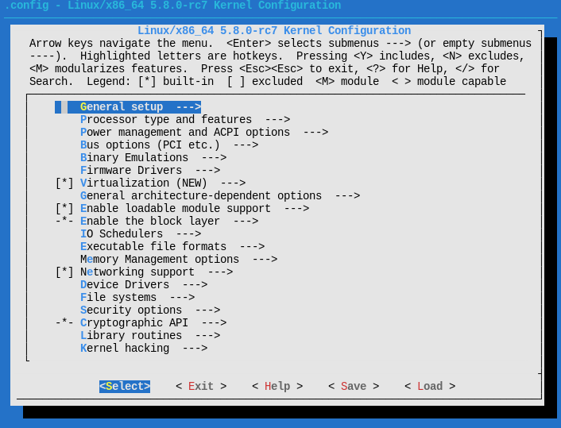

[TOC]

current mark: 4

# Kernel

## Create config file

<code>x86_64</code> default config file can be copied from <code>./arch/x86/configs/x86_64_defconfig</code>

```shell
make ARCH=x86_64 x86_64_defconfig
```

Or use <code>menuconfig</code> (need to use xfce4-terminal, bash ):

```shell
make ARCH=x86_64 menuconfig
```

And process relevant option in the following graphic menu:



### Options

#### Debug (using GDB)

Pick the following compiling options:

1. <code>General setup -> Initial RAM filesystem and RAM disk support</code>
2. <code>Device Drivers -> Blockdevices -> RAM block device support</code>, set "number=16" and "size=65536"
3. <code>Kernel hacking -> Compile-times checks and compiler options -> Compile the kernel with debug info</code>
4. <code>Kernel hacking -> Compile-times checks and compiler options -> Provide GDB scripts for kernel debugging</code>

For the supporting of ram-disk file system and debug.

## Compile kernel

Simply type:

```shell
make
```

to compile kernel, or use multi-thread compilation:

```shell
make -j16
```

where <code>16</code> is the maximum number of threads

(note: do not only type <code>make -j</code>, machine will die)

If succeed, the following will prompt:

```bash
Setup is 13884 bytes (padded to 14336 bytes).
System is 8831 kB
CRC 16fc05a9
Kernel: arch/x86/boot/bzImage is ready  (#1)
```

Compilation result <code>./arch/x86/boot/bzImage</code>, which is a gzip compressed form, and <code>./vmlinux</code>, which is not compressed.

## Clean compiled files

The following clean all compiled files.

```shell
make mrproper
```

# GNU Assembly

## Operators

### Infix

|Operator|Priority|Functionality|
|-|-|-|
|*|High|Multiplication|
|/|High|Division|
|%|High|Reminder|
|>>|High|Shift right|
|<<|High|Shift left|
|\||median|Bitwise or|
|&|median|Bitwise and|
|^|median|Bitwise xor|
|!|median|Bitwise or not|
|+|low|Addition|
|==|low|Equal, return -1 if true, 0 otherwise|
|!=|low|Not equal, return -1 if true, 0 otherwise|
|>|low|Greater than, return -1 if true, 0 otherwise|
|<|low|Less than, return -1 if true, 0 otherwise|
|>=|low|Greater than or equal, return -1 if true, 0 otherwise|
|<=|low|Less then or equal, return -1 if true, 0 otherwise|

## macro

By using commands <code>.macro</code> and <code>.endm</code> allow you to define macros that generate assembly output.

<code>.macro *name* [*arg1*] [*arg2*] ...</code> defines a macro with name of *name* and several arguments.

There are several attribute can be put on arguments:

|Attribute|definition|
|-|-|
|arg:req|This argument require a non-blank value for this argument|
|arg:vararg|This argument takes all of the remaining arguments|
|arg=default|This argument has a default value|

Argument <code>arg</code> can be referenced as <code>\arg</code> inside the macro definition.

After finishing defining the macro, using <code>.endm</code> to indicate an end of definition.

## Section

Defined as block of bytes complied by as, which the size and order does not change in the following linking stage.

Default 3 sections from GAS is text, data and bss. These sections can be empty. text section at address 0 of the object file, data and bss follows

### Section attribute

For ELF format, the following flags can be set:

|Flag|Meaning|
|-|-|
|a|section is allocatable|
|d|section is a GNU MBIND section|
|e|section is excluded from executable and shared library.|
|w|section is writable|
|x|section is executable|
|M|section is mergeable|
|S|section contains zero terminated strings|
|G|section is a member of a section group|
|T|section is used for thread-local-storage|

### linking section

Without <code>*.lds</code> file present, linker will only deal with the following sections.

|Section|Use|Storage|Accessability|
|-|-|-|-|
|Text | Used for storing executable code|Saved in the object file|readable but not writable|
|Data | Used for storing data|Saved in the object file|readable & writable|
|Bss |Used to store uninitialized global, static variables|Allocate at runtime|readable & writable|
|Absolute|Address 0 of this section is always “relocated” to runtime address 0|||
|Undefined|All address references to objects not in the preceding sections|||

### as internal sections

These sections are meant only for the internal use of **as** compiler.

### Subsection

A section could has subsection of 0~8192, which will re-ordered from lower to higher by **as** when creating obj files.

This allow users to write discontinues source code and put them in continues address when creating obj file.

The default subsection is 0, so if <code>.text</code> was used only, the code will be included in subsection of <code>.text 0</code>.

Thus if no subsection is applied, all code will be compiled into subsection 0.

*e.g: To declare subsection of <code>.text</code>, use numeric after section name such as <code>.text 1</code>*

### ELF section stack manipulation directives

Due to the [subsection](#subsection) mechanism, a conceptual section stack will be used to illustrate the operation of section.

#### .previous

This directive swaps the current section (and subsection) with most recently referenced section or subsection pair prior to this one. 

e.g:

```S
.section A
   .subsection 1
      # Now in section A subsection 1
      # Section stack: |A|A1|
      .word 0x1234
.section B
   .subsection 0  
      # Now in section B subsection 0
      .word 0x5678
   .subsection 1
      # Now in section B subsection 1
      .word 0x9abc
.previous
   # Now in section B subsection 0
   .word 0xdef0
```

Above code will place 0x1234 into section A, 0x5678 and 0xdef0 into subsection 0 of section B and 0x9abc into subsection 1 of section B.

#### .pushsection & .popsection

<code>.pushsection *name* [,*subsection*] ["*flat*"]</code> save the current section and subsection to the top of section stack, and replace the current section and subsection with *name* and *subsection*.

<code>.pushsection</code> replaces the current section and subsection with the top section and subsection on the section stack, then pop them out.

##### Sample

The following is ARM code:

```c
unsigned long ret;

asm volatile(
   "1: ldr %0,[%1]\n"
   "2:\n"
   ".pushsection .text.fixup, \"ax\"\n"
   "3b\n"
   "mov %0, $0x89\n"
   "b 2b\n"
   ".popsection\n"
   ".pushsection __ex_table, \"ax\"\n"
   ".long 1b, 3b\n"
   ".popsection\n"
   :"=&r"(ret)
   :"r"(addr)
);
```
###### Target & background

The purpose of this code is to test if <code>addr</code> is a valid aligned. If yes, then return the value addr pointed at, if not, return 0x89.

ARM generate an interrupt for non aligned instruction, then interrupt handler will search an specific array with the following structure:

```c
struct exception_table_entry
{
   unsigned long insn, fixup;
}
```

<code>insn</code> is the address of instruction cause interrupt, <code>fixup</code> is the pointer of code that if <code>insn</code> interrupt is generated.

###### Analyze of code

The body of code is <code>ldr %0,[%1]</code> it simply load the value pointed by argument 1 (which is <code>addr</code>) into argument 0 (which is <code>ret</code>). If the <code>addr</code> is not an aligned address, interrupt is generated.

Interrupt handler will scan <code>exception_table_entry</code>, which located in section <code>__ex_table</code>, thus using <code>.pushsection</code> switch to define an entry as <code>.long 1b, 3b</code> with <code>insn</code> pointing to the body of code and <code>fixup</code> pointing to the process of fixup, and using <code>.popsection</code> to switch back to the current section.

Fixup at symbol <code>3b</code> also should be placed in specific section named <code>.text.fixup</code>. Same as above with the combined using of <code>.pushsection</code> and <code>.popsection</code> to insert fixup code into the target section, even if the source code is in here.

## Other directive

### .skip/.space

<code>.skip *size*, *fill*</code> is the same as <code>.space *size*, *fill*</code>, which filling the following *size* byte with *fill* value.

# Rootfs

## busybox

### Clone source

Clone the busybox source code from github:

```shell
mkdir busybox
cd busybox
git clone git@github.com:mirror/busybox.git ./
```

### Configure

Same as linux, use menuconfig to select relative settings:

```shell
make menuconfig
```

select <code>Settings -> Build static binary (no shared libs)</code>

Exit and save the config files.

### Compile

Since Arch do not provide static glibc, need to compile and install it in docker:

```shell
docker run -it --rm -e PLAT=manylinux1_x86_64 -v `pwd`:/io quay.io/pypa/manylinux2014_x86_64 /bin/bash
yum update
yum install glibc-static
cd io
make -j16
make install
exit
sudo chown shore ./_install #change owner of the file so that user can manipulate
```

Since we do not save the container, each time will need update and install <code>glibc-static</code>.

By default, the installation destination will by <code>./_install</code> 

## Extra file/dirs

Get current directory to <code>path/to/busybox/_install</code> which result from [busybox](#busybox) installation. 

Execute the following to create neccessary file structures:

```shell
mkdir etc dev mnt
mkdir -p etc/init.d/
touch etc/fstab etc/init.d/rcS etc/inittab
cd dev
sudo mknod console c 5 1
sudo mknod null c 1 3
sudo mknod tty1 c 4 1 
```

Fill in <code>./_install/etc/fstab</code> with the following:

```
proc  /proc proc  defaults 0 0
temps /tmp  rpoc  defaults 0 0
none  /tmp  ramfs defaults 0 0
sysfs /sys  sysfs defaults 0 0
mdev  /dev  ramfs defaults 0 0
```

Fill in <code>./_install/etc/init.d/rcS</code> with the following:

```
mkdir -p /proc
mkdir -p /tmp
mkdir -p /sys
mkdir -p /mnt
/bin/mount -a
mkdir -p /dev/pts
mount -t devpts devpts /dev/pts
echo /sbin/mdev > /proc/sys/kernel/hotplug
mdev -s
```

Fill in <code>./_install/etc/inittab</code> with the following:

```
::sysinit:/etc/init.d/rcS
::respawn:-/bin/sh
::askfirst:-/bin/sh
::cttlaltdel:/bin/umount -a -r
```

Finally, change the file attribute of some files:

```shell
chmod 755 etc/inittab
chmod 755 etc/init.d/rcS

```

## Packup runable filesystem

The process summarized as:

1. Create image with <code>ext3</code> format
2. Copy all files under <code>./_install</code> into the image
3. Create a compressed zip file of the target image

Shell operation as follow

```shell
rm -rf rootfs.ext3
rm -rf fs
dd if=/dev/zero of=./rootfs.ext3 bs=1M count=32
mkfs.ext3 rootfs.ext3
mkdir fs
mount -o loop rootfs.ext3 ./fs
cp -rf ./_install/* ./fs
umount ./fs
gzip --best -c rootfs.ext3 > rootfs.img.gz 
```

# Debug

To make it able to debug, need to select [relavent option](#debug-using-gdb) in the config file.

## Compiler optimization

It is said that the code is written based on assuptiom of "-O2" compiler option.

So simply turnoff optimization will cause crash of the whole compilation.

However, it might be possible to add attributo to specific function:

```c
void __attribute__((optimize("O0"))) foo(unsigned char data) {
    // unmodifiable compiler code
}
```

## vscode

Add debug configuration in <code>launch.json</code>:

```json
"configurations": [
   {
      "name": "kernel-debug",
      "type": "cppdbg",
      "request": "launch",
      "miDebuggerServerAddress": "127.0.0.1:1234",
      "program": "输入程序名称，例如 ${workspaceFolder}/vmlinux",
      "args": [],
      "stopAtEntry": false,
      "cwd": "${workspaceFolder}",
      "environment": [],
      "externalConsole": false,
      "MIMode": "gdb",
      "setupCommands": [
            {
               "description": "为 gdb 启用整齐打印",
               "text": "-enable-pretty-printing",
               "ignoreFailures": true
            }
      ]
   }
]
```

## qemu

Adding gdb support by adding <code>-S -s</code>.

Using Linux/Multiboot boot by specifying <code>-kernel,-initrd,-append</code> so that do not need to install it in the disk image.

Sample:

```shell
qemu-system-x86_64 -S -s -kernel <bzImage> -initrd <file> -append <cmd>
```

Parameters:
1. <code>-S -s</code>: Setup support for GDB, default port is 1234
2. <code>-kernel</code>: Use \<bzImage\> as kernel image
3. <code>-initrd</code>: Use \<file\> (compressed in specific format) used as initial ram disk
4. <code>-append</code>: Use \<cmd\> as kernel command line

Please note:
1. To debug, the accelerator should be turned off, thus do not put <code>-accel kvm</code> into the command
2. To insert a break point, should either compile the kernel without <code>CONFIG_RANDOMIZE_BASE</code>, or add "nokaslar" to kernel command by using <code>-append</code>

## GDB

Start gdb and loading linux symbols:

```shell
gdb ./vmlinux
```

Connect to debug port:

```shell
(gdb) target remote:1234
```

Set break point:

```shell
(gdb) break start_kernel
```

Run until the break point with <code>c</code> command, then switch to source layout to view source code:

```shell
(gdb) layout src
```

### GDB commands

#### Break

1. <code>break XXXX</code>: place break point at symbol "XXXX"
2. <code>hbreak *0xXXXX</code>: place hard break point at (virtual) address "0xXXXX"
3. <code>info break</code>: list all break points
4. <code>delete #No</code>: delete break point by "#No" listed in <code>info break</code>

#### Step

1. <code>si</code>: single step for assembly instruction
2. <code>ni</code>: next step for assembly instruction
3. <code>s</code>: single step for source code
4. <code>n</code>: next step for source code
5. <code>c</code>: run untill meet break point

#### View content

1. <code>info r</code>: print registers(including segments)
2. <code>x/nfu expression</code>: n = number, f = format(x=hex), u = len(g=8byte); 
   1. <code>x/16xg $rsp</code>: display 16 of length 8 byte with hex format start at address pointed by rsp register
   2. <code>x/16xg 0xffffffff82000210+(8* 201)</code>: display 16 of length 8 byte with hex format start at address of <code>0xffffffff82000858 = 0xffffffff82000210+(8*201) - 16</code>
3. <code>info r</code>: print registers(including segments)
4. <code>display /fmt expr</code>: display the value of "expr" each break with format "/fmt"
   1. <code>/x</code>: hex format
   2. <code>/c</code>: char format
   3. <code>/f</code>: float format
5. <code>undisplay #No1 #No2...</code>: cancel display of expression <code>#No1 #No2...</code>
6. <code>p /fmt expr</code>: view the value of "expr" with format "/fmt"

#### Others

1. <code>layout XXXX</code>: use "XXXX" view as layout
   1. <code>r</code>: Assembly view
   2. <code>src</code>: Source code view
2. <code>quit</code>: quit gdb
3. <code>disassmble 0xXXXX,+length</code>: disassmble from address "XXXX" 
4. <code>bt</code>: view calling stack(trace caller of the function)

# Source code

## ALTERNATIVE

This is an [GAS macro](#macro), located in <code>arch/x86/include/asm/alternative-asm.h:54</code>. Source code is as follow:

```c
/*
 * Define an alternative between two instructions. If @feature is
 * present, early code in apply_alternatives() replaces @oldinstr with
 * @newinstr. ".skip" directive takes care of proper instruction padding
 * in case @newinstr is longer than @oldinstr.
 */
.macro ALTERNATIVE oldinstr, newinstr, feature
140:
	\oldinstr
141:
	.skip -(((144f-143f)-(141b-140b)) > 0) * ((144f-143f)-(141b-140b)),0x90
142:

	.pushsection .altinstructions,"a"
	altinstruction_entry 140b,143f,\feature,142b-140b,144f-143f,142b-141b
	.popsection

	.pushsection .altinstr_replacement,"ax"
143:
	\newinstr
144:
	.popsection
.endm
```

### Analyze

#### ALTERNATIVE

The body of macro is <code>oldinstr+skip pad</code>. And if the <code>feature</code> argument has specific bit set, then will replace <code>oldinstr</code> with <code>newinstr</code>. So that system can auto adjust best code for specific situation (e.g: select best code for different type of CPU). The following will illustrate some of the code to make the whole picture:

<a id = "bkmk4"></a>```c
.skip -(((144f-143f)-(141b-140b)) > 0) * ((144f-143f)-(141b-140b)),0x90
```

According to [operator](#infix) that the operator of <code>></code> will return $-1$ if true, $0$ otherwise. Thus if the <code>len(newinstr)>len(oldinstr)</code> the <code>-(((144f-143f)-(141b-140b)) > 0)=-(-1)=1</code>, then this code will add <code>0x90</code>(No operation) instruction for the rest of length.

```c
.pushsection .altinstructions,"a"
altinstruction_entry 140b,143f,\feature,142b-140b,144f-143f,142b-141b
.popsection
```

This piece of code switch to <code>.altinstructions</code> section and using [altinstruction_entry](#bkmk3) macro to create an [struct alt_instr]($bkmk1) structure. Then switch back to the current section.

```c
.pushsection .altinstr_replacement,"ax"
\newinstr
.popsection
```

This piece of code save <code>newinstr</code> in a special section named <code>.altinstr_replacement</code>.

#### apply_alternatives()

After the above preparation, kernel will call <code>apply_alternatives</code> function to replace the relative string. It's located and code are as [follow](#bkmk2).

The function will scan from <code>start</code> to <code>end</code> of section <code>.altinstructions</code> And replace the instructions according to <code>(struct alt_instr *)a->cpuid</code> value. The next content of this chapter will analyze some of the code to illustrate the replacing mechanism:

```c
if (!boot_cpu_has(a->cpuid)) {
   if (a->padlen > 1)
      optimize_nops(a, instr);

   continue;
}
```

<code>boot_cpu_has(a->cpuid)</code> macro check if the cpu has specific target bit set. If yes, replace the old instruction. Otherwise use <code>optimize_nops()</code> to clear the <code>0x90</code>(No operation) instruction created by [previous instruction](#bkmk4).

```c
memcpy(insn_buff, replacement, a->replacementlen);
```

This piece of code replace the old instruction with the new instruction.

The rest of code doing 2 things:
1. Resolve the relative <code>jmp</code> (machine code <code>0xe8</code>) address
2. Add <code>0x90</code>(No operation) instruction if old instruction is longer than new instruction.

### Other reference

<a id = "bkmk1">struct alt_instr</a> structure in file <code>linux/arch/x86/include/asm/alternative.h:58</code>:

```c
struct alt_instr {
	s32 instr_offset;    /* original instruction */
	s32 repl_offset;     /* offset to replacement instruction */
	u16 cpuid;           /* cpuid bit set for replacement */
	u8  instrlen;        /* length of original instruction */
	u8  replacementlen;  /* length of new instruction */
	u8  padlen;          /* length of build-time padding */
} __packed;
```

<a id = "bkmk2">apply_alternatives</a> function in file <code>arch/x86/kernel/alternative.c:372</code>

```c
void __init_or_module noinline apply_alternatives(struct alt_instr *start,
						  struct alt_instr *end)
{
	struct alt_instr *a;
	u8 *instr, *replacement;
	u8 insn_buff[MAX_PATCH_LEN];

	DPRINTK("alt table %px, -> %px", start, end);
	/*
	 * The scan order should be from start to end. A later scanned
	 * alternative code can overwrite previously scanned alternative code.
	 * Some kernel functions (e.g. memcpy, memset, etc) use this order to
	 * patch code.
	 *
	 * So be careful if you want to change the scan order to any other
	 * order.
	 */
	for (a = start; a < end; a++) {
		int insn_buff_sz = 0;

		instr = (u8 *)&a->instr_offset + a->instr_offset;
		replacement = (u8 *)&a->repl_offset + a->repl_offset;
		BUG_ON(a->instrlen > sizeof(insn_buff));
		BUG_ON(a->cpuid >= (NCAPINTS + NBUGINTS) * 32);
		if (!boot_cpu_has(a->cpuid)) {
			if (a->padlen > 1)
				optimize_nops(a, instr);

			continue;
		}

		DPRINTK("feat: %d*32+%d, old: (%pS (%px) len: %d), repl: (%px, len: %d), pad: %d",
			a->cpuid >> 5,
			a->cpuid & 0x1f,
			instr, instr, a->instrlen,
			replacement, a->replacementlen, a->padlen);

		DUMP_BYTES(instr, a->instrlen, "%px: old_insn: ", instr);
		DUMP_BYTES(replacement, a->replacementlen, "%px: rpl_insn: ", replacement);

		memcpy(insn_buff, replacement, a->replacementlen);
		insn_buff_sz = a->replacementlen;

		/*
		 * 0xe8 is a relative jump; fix the offset.
		 *
		 * Instruction length is checked before the opcode to avoid
		 * accessing uninitialized bytes for zero-length replacements.
		 */
		if (a->replacementlen == 5 && *insn_buff == 0xe8) {
			*(s32 *)(insn_buff + 1) += replacement - instr;
			DPRINTK("Fix CALL offset: 0x%x, CALL 0x%lx",
				*(s32 *)(insn_buff + 1),
				(unsigned long)instr + *(s32 *)(insn_buff + 1) + 5);
		}

		if (a->replacementlen && is_jmp(replacement[0]))
			recompute_jump(a, instr, replacement, insn_buff);

		if (a->instrlen > a->replacementlen) {
			add_nops(insn_buff + a->replacementlen,
				 a->instrlen - a->replacementlen);
			insn_buff_sz += a->instrlen - a->replacementlen;
		}
		DUMP_BYTES(insn_buff, insn_buff_sz, "%px: final_insn: ", instr);

		text_poke_early(instr, insn_buff, insn_buff_sz);
	}
}
```

<a id = "bkmk3">altinstruction_entry</a> macro in file <code>arch/x86/include/asm/alternative-asm.h:39</code>:

```c
.macro altinstruction_entry orig alt feature orig_len alt_len pad_len
	.long \orig - .
	.long \alt - .
	.word \feature
	.byte \orig_len
	.byte \alt_len
	.byte \pad_len
.endm
```

## __raw_cmpxchg(ptr, old, new, size, lock)

### Location

<code>./arch/x86/include/asm/cmpxchg.h</code>

### Parameter

|Name|illustration|
|-|-|
|ptr|Pointer to the target value|
|old|Old value|
|new|new value|
|size|To determine the size (2/4/8) in byte the operation is on|
|lock|Lock preffix, make sure atomic operation|

### Logic

If <code>*ptr == old</code> then <code>*ptr = new</code>

Else <code>old = *ptr</code>

Return <code>old</code>

## arch_atomic_try_cmpxchg_acquire(atomic_t *v, int *old, int new)

### Location

<code>./include/linux/atomic-arch-fallback.h</code>

### Logic

If <code>(int)*v == *old</code> then <code>*v = (atomic_t)new</code>

Else <code>*old = (int)*v</code>

Retrun <code>*v == *old</code>

# Linux command

## stdin/stdout/stderr & redirection

### stdin/stdout/stderr

Standard in/out/error are defualt file descriptors (<code>current->filp[0/1/2]</code>) within linux process structure. While executing command, linux will write(<code>current->filp.write()</code>) standard in/out/error data into 0,1,2 file descriptor respectively.

The defualt of the three are screen. With write(<code>current->filp.write()</code>)  method, the related infomation will be printed on screen.

In command line, the file descriptor 0/1/2 natively named "0,1,2" respectively.

### redirection

<code>a > b</code> : 

1. For file name "a" and "b", locate related file descriptor <code>current->filp[x]</code> and <code>current->filp[y]</code>
2. Make <code>current->filp[x]=current->filp[y]</code>
3. If <code>a=0/1/2</code> means standard in/out/error

<code>a >> b</code> :

1. Similar to <code>a > b</code> but will set data pointer of "b" to <code>EOF</code> (End Of File)
2. More like write append
3. If <code>a=0/1/2</code> means standard in/out/error

<code>a >& b</code> :

1. Similar to <code>a > b</code>
2. If <code>a=0/1/2</code> or <code>b=0/1/2</code> means standard in/out/error

### sample

```shell
nohup java -jar app.jar 1>>log 2>&1
```

Firstly, the above command uses <code>1>>log</code>, according to [redicrection](#redirection), it equals stdout to file "log" and set the data pointer of "log" to <code>EOF</code>.

Secondly, it uses <code>2>&1</code>, according to [redicrection](#redirection), it equals stderr to stdout, which is now file "log".

While executing the command, the programm will:

1. Open file descritptor of stdin/stdout/stderr and "log"
2. Set the data pointer of "log" to <code>EOF</code>
3. Write standard output to "1", which is redirected to file "log"
4. Write standard error to "2", which is redirected to "1" and redirected to "log"

## "&&" and "||"

```shell
command1 && command2 [&& command3 ...]
```

Only execute command on the right when command on the left return true.

```shell
command1 || command2 [|| command3 ...]
```

Only execute command on the right when command on the left return false.

## man

Display mannual for specific linux command.

Example for displaying mannual for <code>ls</code> command

```shell
man ls
```

## dmesg

Display the messages in "kernel-ring buffer", where linux will dump kernel related informations.

<code>-c, --read-clear</code> : Clear the ring buffer after first printing its contents
<code>-C, --clear</code> : Clear the ring buffer 
<code>-s, --buffer-size size</code> : Use  a buffer of size to query the kernel ring buffer.  This is 16392 by default
<code>-n, --console-level level</code> : Set the level at which printing of messages is done to the console

example:

```shell
sudo dmesg | grep DMA
```

## grep

Catch lines from command output that include specific string 

example:

```shell
sudo dmesg | grep DMA
```

## ld

Format as

```shell
ld [options] <obj files>
```

<code>-o</code>: Specify output file name
<code>-l</code>: "lc" same as "-l c", format is "l <namespec>" while in this case <namespec>=c. It tell ld to find "lib<namespec>.a" which in this case "libc.a"

## find

```shell
find path -option [-print]
```

<code>path</code>: Directory to execute search
<code>-print</code>: Output to stdout

### Option

<code>-name</code>: Specify name without leading directory, can use "?" for one uncertain character and "*" for uncertain string.
<code>-path</code>: Specify the whole directory (includeing file name & leading directory) pattern for search
<code>-type</code>: "b/d/c/p/l/f" stand for "block device, directory, character device, normal files"
<code>\<expr1\> -a \<expr2\></code>: <code>\<expr2\></code> only valued if <code>\<expr1\></code> return true
<code>\<expr1\> -o \<expr2\></code>: <code>\<expr2\></code> only valued if <code>\<expr1\></code> return false
<code>!\<expr\></code>:  return inverse of <code>\<expr\></code>
<code>-prune</code>: If the file is a directory, descend into it.

#### Sample 1

```shell
find ~/OneDrive -path ~/OneDrive/manjaro_note -a -prune -o -name *.org -a -print
```

will first:

1. Only "~/OneDrive/manjaro_note" match <code>-path</code>, return ture
2. <code>-a</code> indicating execute <code>-prune</code> when found is "~/OneDrive/manjaro_note"
3. <code>-prune</code> return true since "~/OneDrive/manjaro_note" is a directory, and do not descend into it.
4. <code>-o</code> will not execute only if <code>-path ~/OneDrive/manjaro_note -a -prune</code> is false
5. <code>-name</code> match the filename.

In conclusion, <code>-path ~/OneDrive/manjaro_note -a -prune</code> return ture only if what found is "~/OneDrive/manjaro_note" and stop search any files under the direcotry. Other files not in "~/OneDrive/manjaro_note" will be valued by <code>-name *.org</code> and if true, will be printed.

#### Sample 2

```shell
find ~/OneDrive -type f -print0 | xargs -0 -P 8 grep -n "DESCRIPTION"
```

1. <code>-type f</code>: Only display file objects (not directory)
2. <code>-print0</code>: Use null character as separator of results to display
3. <code>xargs -0 -P 8</code>: Process each null separated input as parameter of the following cammand
   "-0" indicates the input is null separated
   "-P 8" indicates max parallel of 8 processing unit
4. <code>grep -n "DESCRIPTION"</code>: Find string "DESCRIPTION", "-n" display line number

This command find all files that containning string of "DESCRIPTION" under directory of <code>~/OneDrive</code>
# gcc

Format as

```shell
gcc [options] <source files>
```
|Option|Illustration|
|-|-|
|<code>-m64</code>| Set int to 32 bits, long & pointer to 64 bits, generate x86_64 architechture|
|<code>-c</code>| Compile but do not link, create .o files|
|<code>-g</code>| Compile with debug information|
|<code>-o</code>| Specify output file name|
|<code>-fPIC</code>| If supported for the target machine, produce position-independent code|
|<code>-fvisibility=[default|internal|hidden|protected]</code>| Set the defualt attribute for export table of executable, can be overridden by <code>\_\_attribute__ ((visibility("default|internal|hidden|protected")))</code> within source codes.|
|<code>-z muldefs</code>| Allow multiple definition|
|<code>-s</code>| Remove all symbol table and relocation information from the executable.|
|<code>-D</code>| Provide command line macro definition e.g. <code>-D 'DEV_PATH="/dev/demo"'</code> same as <code>#define DEV_PATH "/dev/demo"</code> in C code|